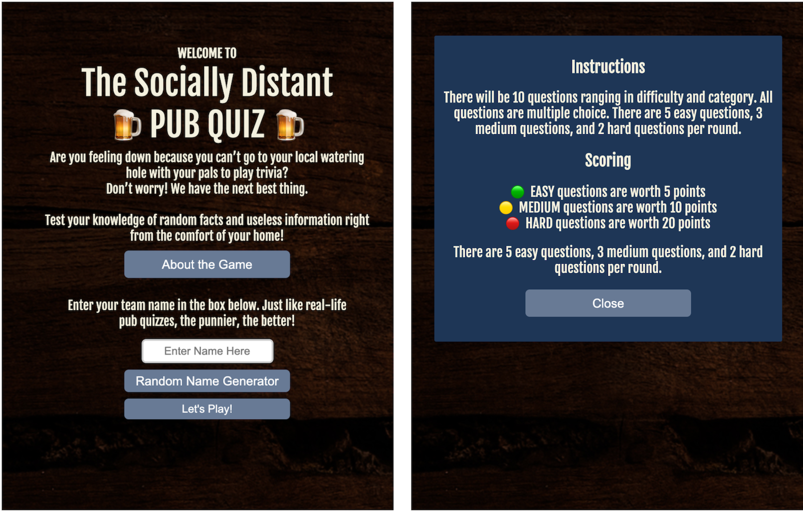
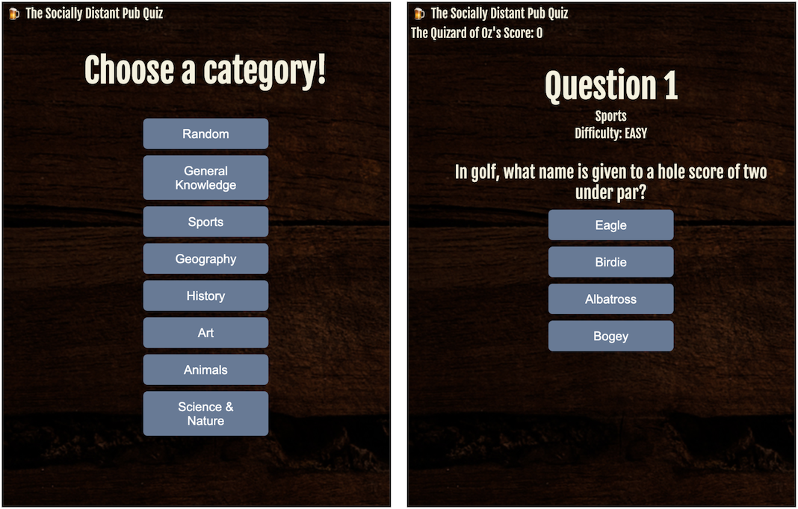
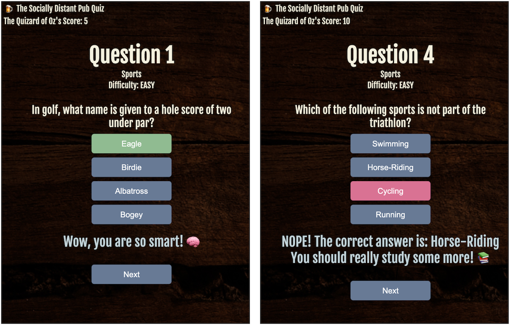
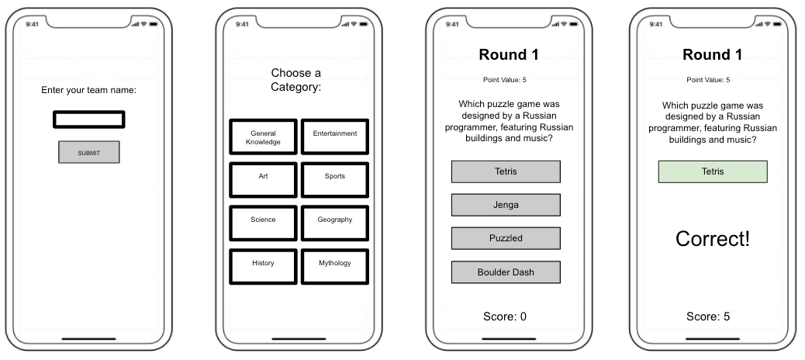

# Project #1: Socially Distant Pub Quiz

## Description
Pub quizzes and trivia nights were a cornerstone of my social life before COVID-19.  Since we all can’t gather at a bar to compete against other teams for the trivia title, I wanted to create a game to mimic the rush of testing your knowledge of random facts. In this game, the user will be able to enter their team name (the punnier the better), select categories to get quizzed on, answer 10 multiple choice questions for the chance of getting a high score. 

## Screenshots of the App

## Technologies Used
- Javascript
- HTML 5
- CSS3
- DOM Manipulation
- Fetch API

## Installation Instructions
Clone this project from Github, and open the HTML file in a browser or open the project in an IDE and open on a server like LiveServer.

## User stories
- As a user I want to be able to play trivia on any device without leaving my home.
- As a user, I want to enter my name/username so I have my game be personalized.
- As a user, I want the application to track my score so I don’t have to do it myself.
- As the user, I want to select the category for my next round of questions so I can pick categories I am more familiar with.
- As a user, I want to be able to click on the correct answers rather than typing them in for ease of use.
- As a user, I want to know what the correct answer is if I get it wrong.
- As a user, I want to play an aesthetically pleasing game that draws me in and keeps me coming back.
- As a user, I want a large bank of questions so I don’t get repeats.
- As a user, I want the game to be clearly explained before I start playing.

## Wireframes

##  Unsolved problems/ Major Hurdles
- A major hurdle was figuring out how to store the API information.  For my MVP, I built the game with a static database of 10 questions, so my initial plan was to replicate that database by pulling 10 questions from the online trivia database before every new game and storing it in an array (each quesiton was its own object in the array).  This was unsuccessful since fetched data can't be saved like regular data and requires a much more advanced understanding. Instead, I fetched each question on the fly based on certain parameters (category selected by user and difficulty based on which number question that were saved in temporary variables) and displayed that information to the current question.
- Another major hurdle I had was assigning the answers to buttons in a random order.  The answer data from the API comes from the database with one correct answer that is held as a string, and 3 incorrect answers that come in an array. As such, this is how I replicated in my static database when I was building the MVP. In my first pass (while using my static database), I created an new array with the 3 incorrect answers, then pushed the correct answer to that array.  I created a way to pick a random index and then used that index to extract an answer from the array of all the answers and assign it to one of the answer buttons. I didn't realize there was a problem when I cycled through all the questions in the database, and started a new game.  I realized when I was changing the arrays that I thought were new copied values, they were actually just references to the original data.  It was changing the original data, and then in the second cycle items were missing from the array.  As a result, I decided to use a random index from an array of indices and use that to select the answers to be assigned to the button rather than using the actual data itself.

## Sources:
- In order to set up the template of my HTML file and have something to model the organization and arrangement after, I used the Dots Repo found here.
    - https://git.generalassemb.ly/sei-921/event-listener-demo
- For my array of Random Pub Quiz Names (const pubQuizNames in script.js), I sourced the names from the following websites: 
    - https://www.quizcoconut.co.uk/100-quiz-team-names-ideas, 
    - https://www.sportsfeelgoodstories.com/trivia-team-names-for-the-clever/ 
    - https://www.findteamnames.com/trivia-team-names/
- Trivia Database used for API fetch: https://opentdb.com/
- I used code and based my modal after the in class modal exercise we did here:
    - https://git.generalassemb.ly/sei-921/modals_intro
- In using the API, some of the text comes encoded in HTML, for example quotation marks (") showed up as \&quot;.  When researching the problem, I came across a helpful function to help me decode HTML to plain text here: 
    - gomakethings.com/decoding-html-entities-with-vanilla-javascript/